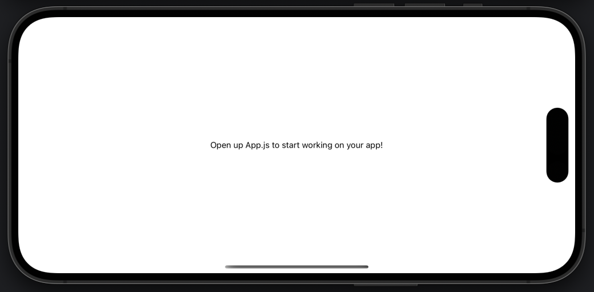
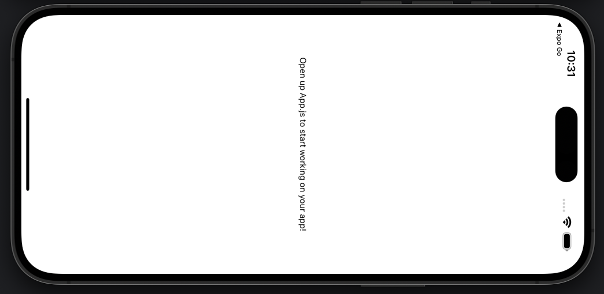

# Screen Orientation Bug

Running this project's `main` branch demonstrates that screen orientation updates in Expo Go, but not an EAS build.

See the `solution` branch for a partial solution.

## Run in Expo Go

```bash
npx expo start --ios
```

The app will respond to screen rotation. Good!


## Run EAS Build

```bash
npx expo run:ios
```
The app will **NOT** respond to screen rotation. Bad!



## Notes

This test was created with these commands.

```bash
npx create-expo-app@latest
npx expo install expo-screen-orientation
```

It includes this chunk of [documented configuration](https://docs.expo.dev/versions/latest/sdk/screen-orientation/#example-appjson-with-config-plugin)
in `app.json`:

```
{
  "expo": {
    "ios": {
      "requireFullScreen": true
    },
    "plugins": [
      [
        "expo-screen-orientation",
        {
          "initialOrientation": "DEFAULT"
        }
      ]
    ]
  }
}

```

The line `"orientation": "portrait"` has been changed to `"orientation": "default"` in `app.json`.

Lastly, prebuild was performed.

```bash
npx expo prebuild --platform ios
```